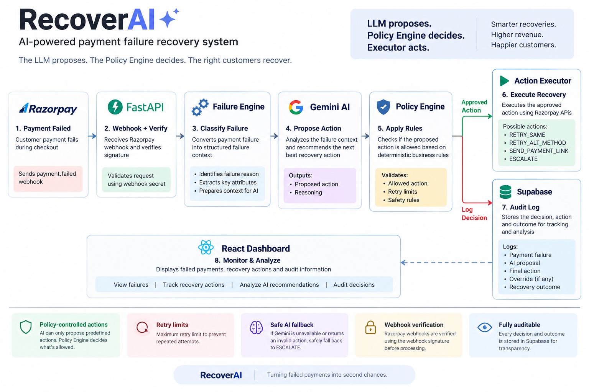

# RecoverAI

AI-powered payment failure recovery system built for the Razorpay AI Buildathon — Track 03: AI Revenue Recovery.

## Problem

When a payment fails, the customer may leave without completing the payment. Different payment failures require different recovery strategies.

RecoverAI analyzes failed payments and recommends the next best recovery action using AI, while deterministic policies control which actions are actually allowed.

## How RecoverAI Works

1. Razorpay sends a `payment.failed` webhook to the FastAPI backend.
2. The Failure Engine converts the payment failure into a structured failure context.
3. Gemini analyzes the failure and proposes a recovery action.
4. The Policy Engine checks whether the proposed action is allowed.
5. Only the policy-approved action reaches the Action Executor.
6. The decision and outcome are stored in Supabase for auditing.
7. The React dashboard displays failures, recovery actions, and audit information.

## Core Principle

> **The LLM proposes. The Policy Engine decides.**

Gemini never directly executes payment actions.

This separation ensures that AI recommendations remain controlled by deterministic business rules.

## Architecture



```text
                         ┌──────────────────┐
                         │     Razorpay     │
                         │  payment.failed  │
                         └────────┬─────────┘
                                  │
                                  ▼
                         ┌──────────────────┐
                         │   FastAPI API    │
                         │ Webhook + Verify │
                         └────────┬─────────┘
                                  │
                                  ▼
                         ┌──────────────────┐
                         │ Failure Engine   │
                         │ Classify Failure │
                         └────────┬─────────┘
                                  │
                                  ▼
                         ┌──────────────────┐
                         │     Gemini AI    │
                         │ Propose Action   │
                         └────────┬─────────┘
                                  │
                                  ▼
                         ┌──────────────────┐
                         │  Policy Engine   │
                         │ Deterministic    │
                         │ Safety Rules     │
                         └────────┬─────────┘
                                  │
                         ┌────────┴─────────┐
                         │                  │
                         ▼                  ▼
                ┌────────────────┐  ┌────────────────┐
                │ Action Executor│  │   Supabase     │
                │    Razorpay    │  │   Audit Log    │
                └────────────────┘  └────────────────┘


Recovery Actions

RecoverAI supports these AI-proposed actions:

RETRY_SAME
RETRY_ALT_METHOD
SEND_PAYMENT_LINK
ESCALATE

The Policy Engine determines which actions are permitted for each failure category.

Safety & Guardrails
1. Policy-controlled actions

The AI can only propose actions from a predefined list. The Policy Engine decides whether the proposed action is allowed.

2. Retry limits

RecoverAI has a maximum retry limit to prevent repeated retry attempts.

3. Safe AI fallback

If Gemini is unavailable or returns an invalid action, RecoverAI safely falls back to ESCALATE.

4. Webhook verification

Razorpay webhook requests are verified using the webhook signature before the payment failure is processed.

Auditability

Every important decision is recorded in Supabase.

The audit log stores information such as:

Payment failure
Failure category
AI-proposed action
AI reasoning
Final action
Whether the AI proposal was overridden
Override reason
Recovery outcome

This makes it possible to understand what the AI recommended and what the system actually allowed.

Tech Stack
Frontend: React
Backend: FastAPI / Python
AI: Google Gemini
Database: Supabase
Payments: Razorpay
Development tunnel: zrok
Demo

The demo shows:

A failed Razorpay Test Mode payment.
The webhook reaching the FastAPI backend.
Gemini proposing a recovery action.
The Policy Engine evaluating the proposal.
A policy override where an unsafe AI recommendation is changed to ESCALATE.
The resulting decision appearing in the RecoverAI audit trail.
What I Learned / What Broke

One challenge was receiving Razorpay webhooks while developing locally. A public development tunnel was required because Razorpay cannot directly access a localhost endpoint.

Another important challenge was separating AI reasoning from payment execution. The Policy Engine was introduced so that Gemini recommendations could never directly control payment actions.

Future Improvements
Persistent webhook idempotency
More detailed recovery outcome tracking
Production deployment
More failure scenarios
Better recovery analytics
Kill switch for recovery actions

Setup
Backend
cd backend

python -m venv venv

Activate the virtual environment on Windows:

.\venv\Scripts\Activate.ps1

Install dependencies:

pip install -r requirements.txt

Create a .env file using .env.example and add your own credentials.

Start the backend:

uvicorn app.main:app --reload
Frontend
cd frontend
npm install
npm start

The frontend runs locally on:

http://localhost:3000

The backend health endpoint is:

http://localhost:8000/health
Environment Variables

Create a .env file containing:

SUPABASE_URL=
SUPABASE_SECRET_KEY=
GEMINI_API_KEY=
RAZORPAY_KEY_ID=
RAZORPAY_KEY_SECRET=
RAZORPAY_WEBHOOK_SECRET=

Never commit .env or real API keys to GitHub.

Project Structure
recoverai/
├── backend/
│   └── app/
│       ├── ai_agent.py
│       ├── audit.py
│       ├── executor.py
│       ├── failure_engine.py
│       ├── main.py
│       └── policy_engine.py
│
├── frontend/
│   ├── public/
│   └── src/
│       ├── App.js
│       ├── App.css
│       └── lib/
│           └── supabaseClient.js
│
├── .env.example
├── .gitignore
└── README.md
Author

Built by Dhwani for the Razorpay AI Buildathon.


